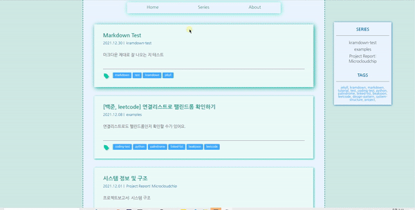
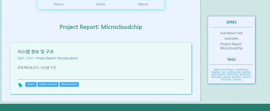
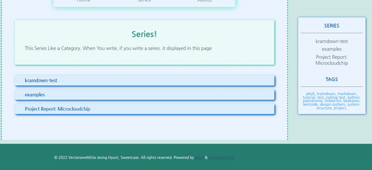

# MINTMINTMINTO!🍃
Do you like mint? There is MINTMINTMINTO that Mint Style Jekyll Theme!

## Demo🌲
### Read Post


### Tag System


### Series (Category)


## Feature💎
* Mint Colored Theme
* Tag System
* Can Make Series Like Category
* Can Use Mathmathic Latex (mathjax)
* Mobile Responsive Web

## Installation💿
1. First, Fork my github repo or click button "use the template" for make your blog
2. use "git clone" your repository
3. install Ruby
4. install bundler
```bash
$ gem install bundler
$ bundle
```
5. start testing
```bash
jekyll serve
```
6. Then, you can write post or debuging, etc...

## Usage✅
### Configuration
It can be controled in ```_config.yml```
|Variable|Type|Default|Specification|
|---|---|---|---|
|```title```|String|```---```|Title of website|

### Store Series
To make your series visible on screen go to ```_data/series.yml``` and write your series name. That is exmaple. **series can be only ascii code. not unicode yet too.** It will be updated for this.
```yml
# _data/series.yml
- kramdown-test
- examples
- "Project Report: Microcloudchip"
```
But If you want to visible series that has with **space bar**, then covered with **double quotes** like last case of exmaple.
### Store Tags
Same process with "Store Series" go to ```_data/tags.yml``` and write tag for visible. That is Example **Tag can be only ascii code. not unicode yet too.** It will be updated for this.
```yml
# _data/tags.yml
- jekyll
- kramdown
- markdown
- tutorial
- test
- project
```
### Post Configuration
|Variable|Type|Default|Specification|
|---|---|---|---|
|```title```|String|```---```|Title of post|
|```date```|Date|```---```|datetime but it visible only year/month/date |
|```series```|String|```---```|Name of Series|
|```summary```|String|```---```|Short summary of post|
|```tags```|List[String]|```---```|Tag list|
|```image```|String|```---```|Image of Post, It will be display first of post|